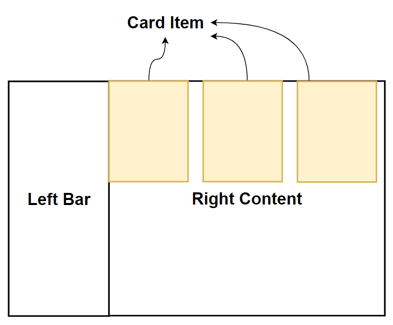
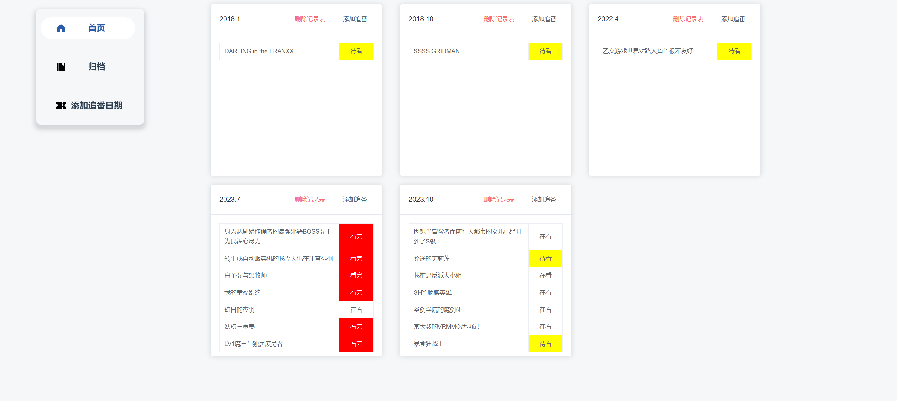
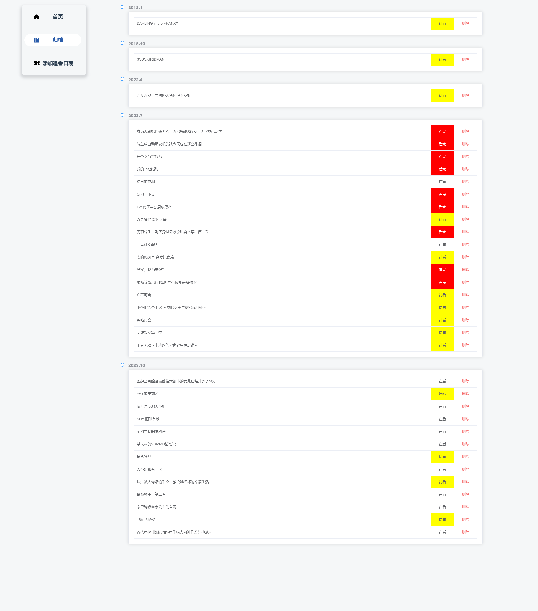
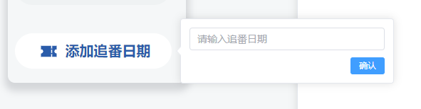
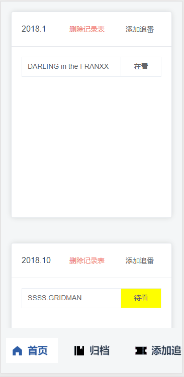

# animerecord

使用vscode开发。
前端: vuecli+vue3+pinia+element plus+nginx。

* 虽然是用vue3，但还是用的vue2的options api来写，打算以后边学边用composition api来代替options api。
* 使用nginx来作为前端网页服务器(做前后端分离)

后端: node.js+express+mysql。
* 使用node.js作为服务端，并使用pm2来进行管理且部署到服务器。
* 使用express框架来做为web框架处理路由。
* 使用mysql作为数据库，并且为了简单只设计了2个数据表。

这个项目我目前是做成了网页的形式，因为在网站上看完一部番后可以直接打开我这个追番记录页面进行记录。但是其实我觉得做成桌面端的优势更大于网页端。如果做成桌面端其实更方便其他人的个人使用。因此，后续打算使用electron来做一个。

## 5.11更新：用webpack优化了包体积
因为网站的首屏打开速度很慢(还有我好像http缓存没设置好还是其他怎么回事，二次打开的速度也不行)，看了一些webpack优化的方法，用webpack-bundle-analyzer发现element-plus打包后的体积很大，使用SplitChunksPlugin让它单独分离。后面本来还想再搞搞，但是发现怕搞崩了，打算再看看文档再试试。

## 5.9更新：添加动画效果
使用gsap库实现了简单的动画效果。在实现的时候，看到gsap官网有个issue是说在vue中用的话可以用ref引用组件来使用，但是实际使用的时候发现一直用不了(感觉是vuecli的问题)，最后还是通过class来引用元素了。

## 5.5更新：添加了dark模式
使用媒体查询监听prefers-color-scheme，如果当前系统开启了dark模式的话，网页也会切换到dark模式。dark模式使用了一个比较简单的方法实现：
* filter可以将模糊或颜色偏移等图形效果应用于元素上。
  * 主要设置了invert和hue-rotate，让它们将颜色完全反转，以及让色调旋转180°，减弱各个颜色的强度。
* 由于filter也会对image，svg这些元素生效，所以对这些元素再做一次filter让其恢复。

## 5.3更新：添加权限控制
~~删除了vuex，使用了pinia来做状态管理，以及使用pinia来实现权限管理。~~
* 收回前言，pinia和vuecli的相性好差，经常用着用着就出问题和各种bug，最后还是用回vuex来做。吃了个教训：对于使用老旧技术栈的应用，不要用新技术在它上面做功能实现覆盖。
* 在nav导航栏中添加了一个权限识别的功能，用来开启对页面的操作权限。如果没有开启就操作表格就会提示错误，其中的权限状态则存放在vuex中。
  * 在request.js中判断vuex中token是否有值，如果有就放到headers.Authorization上。
* 使用一种**基于JWT的密钥机制**来实现权限控制：
  1. 前端用户要输入特定的指令文本(只有自己知道)来开启，然后后端node.js接收到该指令，并检验该指令是否与存放服务器中的指令文本相同，如果相同就根据该指令生成JWT返回给前端；否则就返回400。
  2. 前端接收到后，将该JWT放到header.authorization中。
  3. 如果没有进行权限验证就操作了表单，会提示警告。这部分只需从vuex中验证是否有值。
* 为什么使用vuex来存放权限状态？
  * 我本意是想利用刷新页面时vuex的state会被重置的情况，这意味着权限状态也会被重置，感觉某种意义上也保护了权限安全，比如你身边的朋友经过你的作为，然后看到你用这个来记录，接着就可能使坏想修改一下，那么你可以在离开前刷新下页面就能保证权限状态被重置了，而你的朋友就不会破坏数据了。
* 后端express中多添加了一个permisison_router来管理与权限相关的接口。
  * 拦截所有的post请求，如果没有携带token就报403

## 4.28更新：nginx设置http缓存+开启gzip和修改响应式适配的展示
* 在nginx中设置了http缓存，改善了第二次以后的网页打开速度：
  * 对于html文件设置为协商缓存
  * 对于.css, .js这些文件，以及带hash文件设置为强缓存。
* nginx开启gzip。
* 之前的响应式布局展示是用flex来做的，这次修改为用grid来实现。现在首页右边的card-item的布局变得更灵活和好看。
  * 其实就使用`grid-template-columns: repeat(auto-fill, minmax(400px, 1fr))`来实现，这个功能确实可以很好地根据当前屏幕大小来自适应地分出几列。

## 3.24更新：添加移动端适配后的感想
这个项目是我刚好完成了手头的科研后，有一段空余的时间给自己支配，然后最近因为做追番记录是用excel做的，用着也不美观，所以想到了用vue+node.js快速开发一个这个应用。所以我就怎么快就怎么来，左侧导航栏是我直接从faketaptap那里搬过来用的，因为那个已经封装得还行了，但是就只适合pc端。同时由于有个添加功能我直接搬到了导航栏上，我也就是直接复制一个nav-item改成nav-button，里面的代码逻辑功能是不同的，但是css样式是完全一样。

右侧主体内容是直接用flex布局摆的，所以在移动端上我也就不用改布局了。

因此，尽管只用改导航栏布局，我也改得比较麻烦。移动端适配我直接使用媒体查询来做，但是由于以前css样式写得太过冗余+差劲，我就直接在原有代码上直接添加对移动端的css布局，也没有对代码做一些封装。

以后写代码确实得有点规范才行，但是毕竟以前我写得还不够多没那方面的意识，同时是以做出来为优先，尽管有些代码写了一大堆没生效，但是有些代码能生效就行了，这就导致我后期整理的时候令人痛苦。

## 项目的一些改进 TODO
* 添加网页图标 ✔
* 添加项目描述 ✔
* 使用less来替换原先的css格式(也没什么要替换的，只是用了嵌套改写了一些css代码) ✔
* 添加左侧导航栏对移动端的适配✔
  * 在冗余的代码上直接添加了媒体查询😫来适应移动端，整理了大半天。
* 添加修改信息时的加载动画展示，以及独取信息的加载动作展示(使用element-plus的Loading组件做)。✔
* 改进追番记录的按序展示，用computed来对数据根据日期做排序，无需服务端那边做排序后再返回数据。✔
* 改进添加新的追番记录后使用reload的方式来重新获取数据并刷新页面的方式：
  * 用vuex或者事件总线来传递nav-button的增添新的追番记录信息到Home中。

## 前端网页运行

```
cd ./animerecord
npm install
npm run serve
```
## 后端运行
```
cd ./animerecord_nodejs
node app.js
```
## 预想的框架界面


## 网页展示

### 首页

* 按时间升序的方式排列出每个追番记录表，其中每个表用卡片做展示。
* 所有的内容修改(除了删除)都会在该页面中做处理。
* 双击单元格可以切换为输入框并修改，当失去焦点时会恢复为原来的单元格。如果修改了内容并且按下回车会提交修改并失去焦点。
* “添加追番”会对当前记录表增添一行记录，但是只有对其做修改了才会提交修改并保留，否则在刷新页面或者切换到别的页面时会自动删除。
* “删除记录表”会删除当前追番记录表，其会弹出一个框做二次确认。
* 如果表中无数据会展示“空状态(empty)”图片。


### 归档

* 以时间线为主题将所有的追番记录列出来(老实说，我觉得用来做主页展示好像更好看点)。
* 如果某个追番日期下无数据，会展示“空状态(empty)”图片。
* 添加对某一个追番记录表中的动画记录做删除，其会弹出一个框做二次确认。


### 添加追番日期

* 其会向右弹出一个框来输入追番日期从而添加一个追番记录表。当确认添加后会刷新一次首页组件从而再读取数据。(向首页组件添加`inject: ['reload']`)。

### 响应式布局+移动端适配
* 使用grid布局实现响应式布局：


* 使用媒体查询实现移动端适配：



## mysql数据表
### anime_date
| date_id(key) | date_name |
| ------- | --------- |
| varchar | varchar   |
* date_id: 使用年月日时分秒的形式来作为唯一id
* date_name: 格式为"2018.1"

### anime_record
| record_id(key) | date_id | anime_name | watch_status|
| ----- | ----- | ----- | ----- |
| varchar | varchar | varchar | varchar | 
* record_id: 使用年月日时分秒的形式来作为唯一id
* date_id: 外键


## 项目主要功能 TODO
* 左侧导航栏(首页, 归档, 添加追番日期) ✔
* 首页:
  * card-item的展示 ✔
  * card-item的点击单元格即可修改：双击单元格切换成输入框做修改，并且输入框自动对焦。输入框失去焦点时切换回原样并保存数据 ✔
  * card-item的删除: 删除对应的追番记录表 ✔
  * card-item的追番日期修改 ✔
* 归档:
  * 将所有的追番记录用时间线的方式列出来 ✔
  * 添加追番记录的删除，删除一个追番表中的动画 ✔
  * 调大点时间线的时间标题字体(隐藏原有的timestamp，自己做了一个) ✔
* 添加追番日期:
  * 点击后右边弹出一个框，然后可以输入追番日期，确认就是提交，点击空白处就是退出来 ✔
  * 添加完毕后，在主页中能马上出现新的追番记录表(使用inject来做) ✔
* 数据存储：本地json文件存储还是node.js+mysql ?
  * 本地json文件：在Home.vue中获取所有的anime_record并按日期放入每个card-item中，要新增或者修改数据的时候可以用emit返回给Home.vue中做修改。这要求card-item要返回每个anime_record的唯一标识，并根据这个标识做修改。
  * 还是使用node.js+mysql吧。✔
  * 创建一个追番日期的数据表和一个记录追番的数据表(使用年月日分秒作为唯一id)。✔
  * 创建node.js后端和编写路由: 
    * '/getAnimeDate': 获取所有的追番日期 ✔
    * '/getAnimeRecordByDateId': 根据追番日期的id来得到相应的追番记录 ✔
    * '/updateNewAnimeRecord': 添加新的追番记录到相应的追番日期中(点击单元格的记录并修改，如果存在就修改，否则删除) ✔
    * '/updateNewAnimeWatchStatus': 修改追番记录的观看状态 ✔
    * '/addNewAnimeDate': 增添新的追番日期 ✔
    * '/deleteAnimeRecord': 根据date_name删除anime_date的追番日期，并且也删除anime_record中的追番记录 ✔
    * '/updateRecordDateName': 根据date_id修改date_name ✔
    * '/deleteAnime': 删除一个追番表中的动画 ✔
* 部署到aliyun linux服务器:
  * 开放端口 ✔
  * 部署node.js后端 ✔
  * 部署vue前端到nginx ✔
