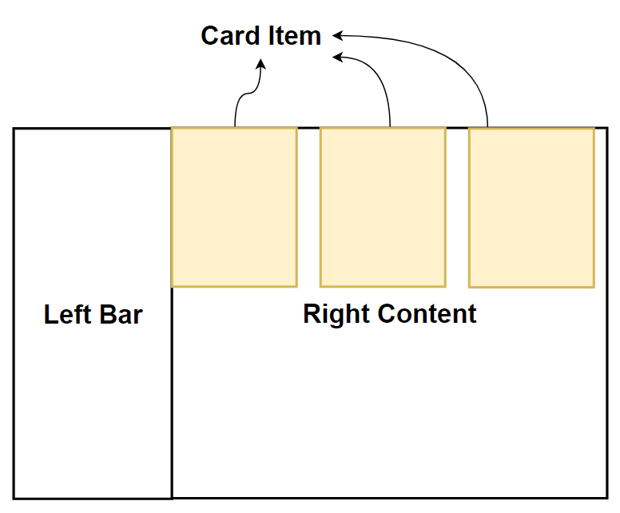

# animerecord

## Project setup
```
npm install
```

### Compiles and hot-reloads for development
```
npm run serve
```

### Compiles and minifies for production
```
npm run build
```

### Customize configuration
See [Configuration Reference](https://cli.vuejs.org/config/).

## TODO
* 左侧导航栏 ✔
* 右侧主要内容展示:
  * card-item的展示 ✔
  * card-item的点击单元格即可修改：双击单元格切换成输入框做修改，并且输入框自动对焦。输入框失去焦点时切换回原样并保存数据 ✔
* 数据存储：本地json文件存储还是node.js+mysql ?
  * 本地json文件：在Home.vue中获取所有的anime_record并按日期放入每个card-item中，要新增或者修改数据的时候可以用emit返回给Home.vue中做修改。这要求card-item要返回每个anime_record的唯一标识，并根据这个标识做修改。
  * 还是使用node.js+mysql吧。✔
  * 创建一个追番日期的数据表和一个记录追番的数据表。✔
  * 创建node.js后端和编写路由: 
    * '/getAnimeDate': 获取所有的追番日期 ✔
    * '/getAnimeRecordByDateId': 根据追番日期的id来得到相应的追番记录 ✔
    * '/addNewAnimeRecord': 新增新的追番记录到相应的追番日期中

### Predecided framework


vue3+element plus